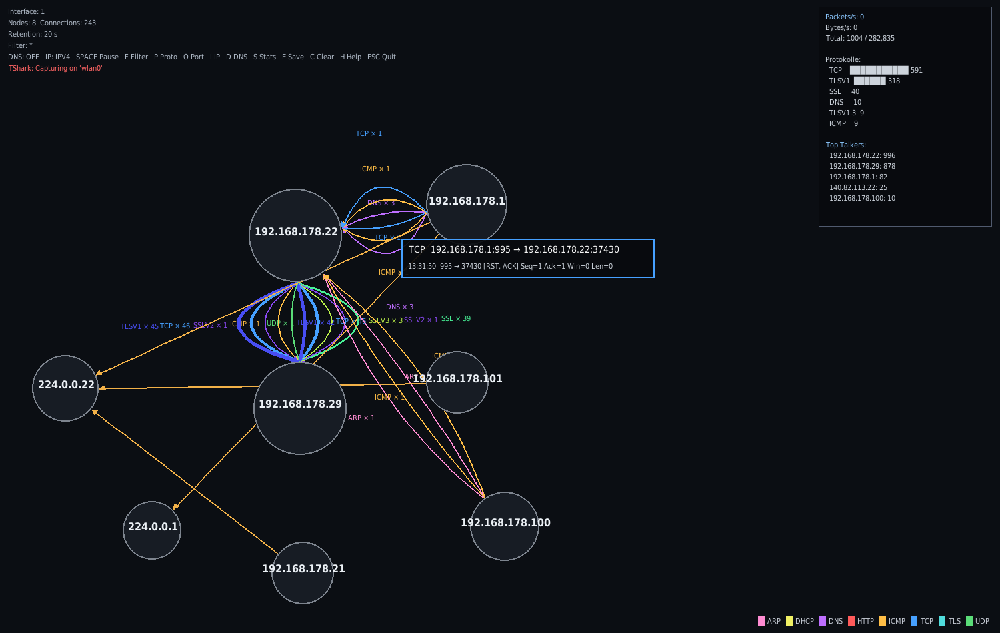

# Netmap GUI

Echtzeit-Netzwerkkarten-Visualisierung mit TShark und Pygame. Zeigt IP-Verbindungen als Kraft-gerichteten Graphen, gruppiert nach Protokoll.



## Installation

```bash
# 1. Systemabhängigkeiten installieren (TShark für Packet-Capture)
sudo apt install tshark

# 2. Virtual Environment erstellen
python3 -m venv .venv

# 3. Python-Abhängigkeiten installieren
.venv/bin/pip install pygame

# 4. Starten (sudo wegen Packet-Capture)
sudo .venv/bin/python netmap.py
sudo .venv/bin/python netmap.py --config config.json
```

## Installation (requirements.txt)

Mit `requirements.txt`:

```bash
pip install -r requirements.txt
```

## Steuerung

| Taste | Funktion |
|-------|----------|
| SPACE | Pause/Resume |
| C | Ansicht leeren |
| H | Hilfe anzeigen |
| F | Text-Filter |
| P | Protokoll-Filter |
| O | Port-Filter (z.B. 443, 80) |
| I | IP-Version wechseln (ALL→IPv4→IPv6) |
| D | DNS-Namensauflösung ein/aus |
| S | Statistik-Panel ein/aus |
| E | Screenshot speichern |
| ESC | Beenden |

Maus: Hover über Kante zeigt Payload-Daten, Scrollrad navigiert History.

## Konfiguration

`config.json` anpassen für:
- Fenstergröße, FPS
- Layout-Physik (Repulsion, Spring, Damping)
- Node-Größe und Retention-Zeit
- Protokoll-Farben

Siehe `DEFAULT_CONFIG` in [netmap.py](netmap.py) für alle Optionen.
