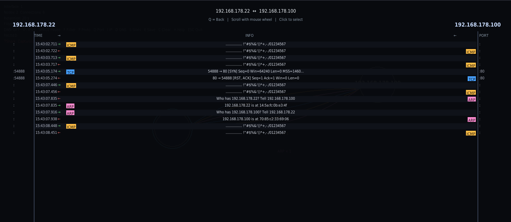
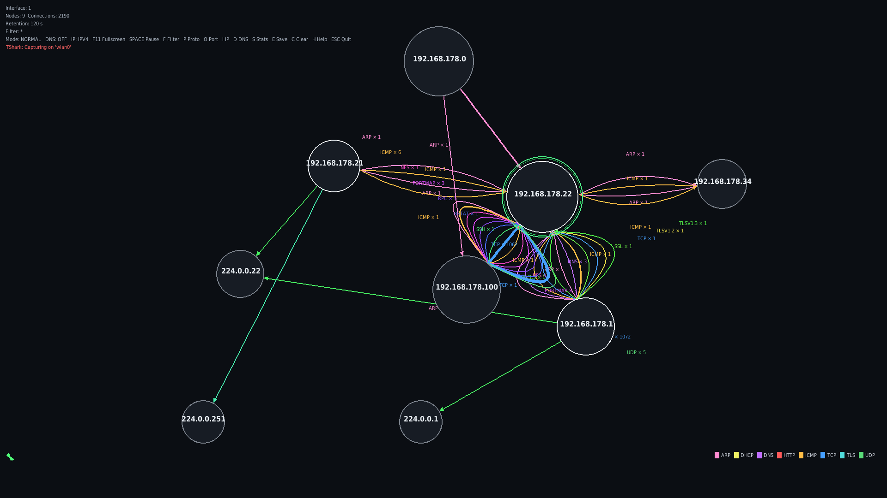

# Netmap GUI

Real-time network map visualization using TShark and Pygame. Displays IP connections as a force-directed graph grouped by protocol.


## Views

**NodeView** (default) — Force-directed graph showing all active IPs as nodes and their connections as colored edges (one line per protocol). Node size scales with traffic (log scale, max 2x). Your local machine is marked with a green double ring.

**DetailView** — Click two nodes to inspect all traffic between them: timestamps, protocols, ports, decoded payloads in a scrollable sequence diagram.

## Screenshots




## Installation

```bash
# Install system dependencies
sudo apt install tshark

# Create virtual environment
python3 -m venv .venv

# Install Python dependencies
.venv/bin/pip install pygame

# Run (sudo required for packet capture)
sudo .venv/bin/python netmap.py
sudo .venv/bin/python netmap.py --config config.json
```

## Controls

| Key | Function |
|-----|----------|
| `W` | Protocol Wiki (searchable reference for all protocols) |
| `F5` | Toggle Promiscuous Mode (PROMISC / NORMAL) |
| `F11` | Toggle Fullscreen |
| `SPACE` | Pause / Resume capture |
| `F` | Text filter (substring, wildcard `*`, multi-term `dns,tcp`) |
| `P` | Protocol filter (exact match, comma-separated) |
| `O` | Port filter (substring match on src/dst port) |
| `I` | IP version (ALL → IPv4 → IPv6 → ALL) |
| `D` | DNS resolution on/off |
| `S` | Statistics panel (packets/s, bytes/s, protocol bars, top talkers) |
| `E` | Save screenshot (PNG with timestamp) |
| `C` | Clear all nodes and connections |
| `H` | Help overlay |
| `ESC` | Quit |

## Interaction

- **Click node** → select (blue ring)
- **Click second node** → DetailView (sequence diagram)
- **Click protocol badge in DetailView** → jump to that protocol in Wiki
- **Hover edge** → payload popup (timestamps, info, last 16 packets)
- **Scroll wheel on popup** → navigate packet history
- **Q** → exit DetailView
- **Click empty space** → deselect

## Protocol Wiki

Press `W` to open. Covers: TCP, UDP, ICMP, DNS, ARP, DHCP, HTTP, TLS, IGMPV3, mDNS, SSDP, NBNS, LLMNR, TLS_CLIENT_HELLO, BROWSER, UDP/XML — with descriptions, bit layouts, flags, and `nc`/tool examples.

Unknown protocols are copied to clipboard when their badge is clicked in the DetailView.

## Configuration

Adjust `config.json` for:
- Window size, FPS
- Layout physics (Repulsion, Spring, Damping)
- Node size and retention time
- Protocol colors

See `DEFAULT_CONFIG` in `netmap/config.py` for all options.
